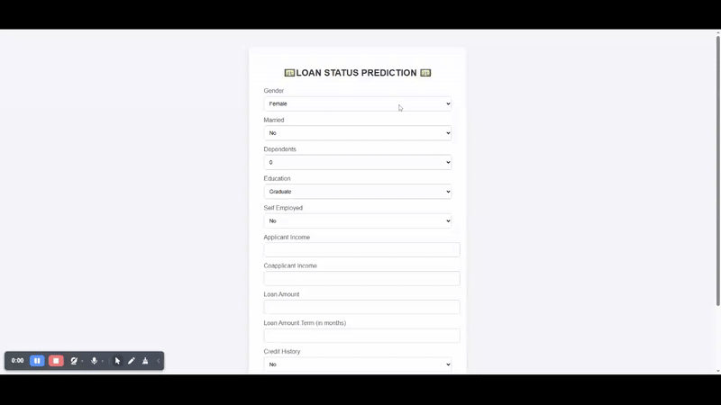

## Demo

 
 

# 💵LOAN STATUS PREDICTION 💵

This is a Flask-based machine learning web application that predicts whether a loan will be **Approved ✅** or **Rejected ❌** based on user input.


## 🚀 Project Overview

This project uses a logistic regression model trained on a dataset of loan applicants to predict loan approval status. The web interface allows users to input details such as income, credit history, and education to get instant predictions.

---

## 🔍 Features

- 🧠 Machine Learning model (Logistic Regression)
- 📊 Preprocessing with StandardScaler
- 🌐 User-friendly web interface with HTML & CSS
- 🔁 Scalable code structure
- 🧪 Unit tests with `pytest`
- 📁 Logging for debugging and monitoring


## Create and activate virtual environment

```  python -m venv vnev ```
####  On Windows
``` vnev\Scripts\activate     ```

## Install dependencies
 ``` pip install -r requirements.txt ```

## Run the Flask app
``` python app.py```

## Running Tests
``` pytest tests/```

## 📈 Model Training 
You can train your own model using the original dataset and export:

- loan_status_predict model using joblib.dump
- scaler for preprocessing

## Authors

- [@candobettercode](https://github.com/candobettercode)


